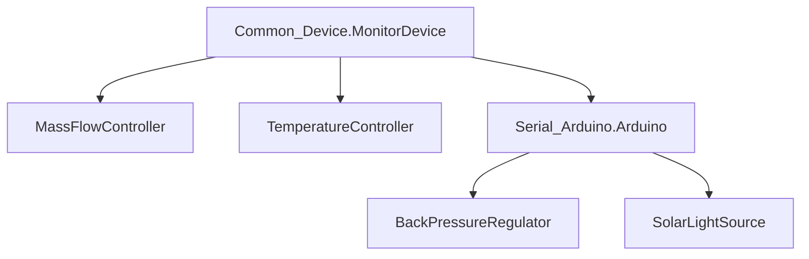

# SolarSimulatorMonitor

Visual interactive tool to control and monitor the different devices that are part of the solar simulator setup on the go.
Any number of setups can be configured, each with their unique combination of devices.

# Supported devices

At the moment this tool supports the following devices:
- Light Controller (Arduino-based, self developed: https://github.com/Noel-Research-Group/solar\_simulator\_controller.git) \[type `Light`\]
- Back Pressure Regulator (Arduino-based, self developed: https://github.com/Noel-Research-Group/variable\_BPR.git) \[type `Pressure`\]
- Omron E5\_C temperature controller with serial-to-USB adaptor \[type `Temperature`\]
- Bronkhorst EL-FLOW mass flow controller with serial-to-USB adaptor \[type `Flow`\]

# Registering a serial device

Known devices are automatically recognized by the program, if they are plugged in and powered when the main program starts.
New devices can be added to the list of known devices (config/known\_devices.json) with the src/Serial\_Devices.py script:

1. Plug the device in, making sure you can easily identify it from a list (disconnect any other unknown device which might confuse you).
2. Launch the src/Serial\_Devices.py script from the project root via the command line.
3. Identify your device from the list and follow the instructions, the script will store as much information as possible about the device in order to recognize it later.
4. If the device is self-developed, you can add a custom identifier to it and register its value too. This can help in case of identical Arduino boards, but slows down the recognition process, as the serial connection must be opened to read the identifier, which requires a few seconds.

> [!note]
> All scripts must be run from the project root folder.

# Creating a new setup 

Similarly to how known devices are stored, device setups (combinations) are stored in config/device\_config.json . At the moment, this file must be modified manually.
To add a setup, insert an element in the main list, for example:
```json
    "Setup_Name": [
        {
            "name": "solarBPR",
            "type": "Pressure"
        },
        {
            "name": "solarLight",
            "type": "Light"
        },
        {
            "name": "MFC_CO2",
            "type": "Flow"
        },
        {
            "name": "MFC_H2",
            "type": "Flow"
        },
        {
            "name": "SolarTemperature",
            "type": "Temperature"
        }
    ],
```
Where `Setup_Name` should be the name you want for your setup. Each element within the sublist requires a name matching a known device from config/known\_devices.json and a type, matching one of the types listed in the [supported devices section](https://github.com/Noel-Research-Group/SolarSimulatorMonitor/edit/master/README.md#supported-devices). It is possible to add multiple devices of the same type, provided their names correspond to separate devices.

# Adding support for a new device

This project aims to be modular and expandable. Each new device will require custom code and behaviour, but there are common
features to all devices and here are basic steps needed to integrate your custom code within the framework of this project. 

## Inheritance structure

Each device (one serial connection) is represented by a class. The class should allow programmatic control of the specific device
as well as some standard methods and variables which the framework expects to find.


Common_Device.MonitorDevice defines all methods and variables which are expected.
To define a new device, inherit from Common_Device.MonitorDevice and set the behaviours according to
what is needed.
Serial_Arduino.Arduino defines additional methods which simplify communicating with self-produced and
arduino-based devices. It in turn inherits from MonitorDevice, so if your new device is Arduino-based,
you should prefer inheriting from Arduino instead.

Author: Simone Pilon - Noël Research Group - 2023
